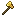

  
Changelog

  

    
2026-04-25

    The initial version!
  

## Setup

**NOTE:** ♣ Pet Luck works exactly like ✯ Magic Find for pet drops, it **doesn't** increase the rarity of dropped pets!  
Term we use for both stats added together: "Effective Magic Find" *(short: EMF)*

###  Armors:

#### Magic Find armor:
- [Sorrow Armor](https://hypixelskyblock.minecraft.wiki/w/Sorrow_Armor) *(+5 ✯ per piece = +20 ✯ for whole set)*
- [Clover Helmet](https://hypixelskyblock.minecraft.wiki/w/Clover_Helmet) *(+5% ✯)*  
  *Reduces most other stats by 5%, including Pet Luck, but as long as your Magic Find is higher than your Pet Luck this item will increase your drop chance.*  
  *Alternative: Sorrow Helmet*

On all Magic Find armor pieces:
- [Renowned](https://hypixelskyblock.minecraft.wiki/w/Reforging#Renowned) reforge *(+1% ✯ per armor piece = +4% ✯ total)*  
- [Legion](https://hypixelskyblock.minecraft.wiki/w/Legion) ultimate enchantment *(+0.07-0.35% ✯ per per player within 30 blocks of you, up to 20 players)*  
  *Only really useful when farming in a group.*  
  *Do not apply this when you plan on using the Zombie Commander Whip! (see [weapon section](#weapon))*

#### Mining armors:
- [Armor of Divan](https://hypixelskyblock.minecraft.wiki/w/Armor_of_Divan) *(+10 ♨ Heat Resistance per piece = +40 ♨ Heat Resistance for whole set)*
  *This is generally the best mining armor, you may use any other mining armor as an alternative*
- [Glossy Mineral Armor](https://hypixelskyblock.minecraft.wiki/w/Glossy_Mineral_Armor) *(+150 ▚ Mining Spread per piece = +600 ▚ Mining Spread for whole set)*
  *Alternative: [Mineral Armor](https://hypixelskyblock.minecraft.wiki/w/Mineral_Armor) (+100 ▚ Mining Spread per piece = +400 ▚ Mining Spread for whole set)*

###  Mining Tool:

Any [drill](https://hypixelskyblock.minecraft.wiki/w/Drills)  
  \+ [Perfectly-Cut Fuel Tank](https://hypixelskyblock.minecraft.wiki/w/Perfectly-Cut_Fuel_Tank) *(-10% Pickaxe Ability cooldown)*
  \+ [Blue Cheese Goblin Omelette](https://hypixelskyblock.minecraft.wiki/w/Blue_Cheese_Goblin_Omelette) *(+1 level to all Heart of the Mountain perks)*

Your mining tool/setup should grant you at least 1,500 Mining Speed, as that's the minimum to be able to instantly mine Hard Stone!

###  Weapon:

1. [Zombie Commander Whip](https://hypixelskyblock.minecraft.wiki/w/Zombie_Commander_Whip)
  \+ [Bobbin' Time](https://hypixelskyblock.minecraft.wiki/w/Bobbin%27_Time) ultimate enchantment on Magic Find armor  *(+0.6-1% ✯ per fishing bobber within 30 blocks, up to 5 bobbers; +2.4-4% ✯ for whole armor set)*  
1. [Blaze Slayer](https://hypixelskyblock.minecraft.wiki/w/Blaze_Slayer) dagger  
  \+ [Coldfused](https://hypixelskyblock.minecraft.wiki/w/Reforging#Coldfused) reforge *(+2 ✯)*  
1. Any other weapon

On any of the aforementioned weapons:  
- [Chimera](https://hypixelskyblock.minecraft.wiki/w/Chimera) enchantment *(copies 20-100% of your pet's stats)*  
- [Divine Gift](https://hypixelskyblock.minecraft.wiki/w/Divine_Gift) enchantment *(+2-6 ✯)*  
- [Looting](https://hypixelskyblock.minecraft.wiki/w/Looting) enchantment *(+15-75% chance for item drops)*  
  *Optional for more Dwarven O's Block Brans and gemstones, does **not** apply to pet drops!*

Alternatively:  
Any high rarity [fishing rod](https://hypixelskyblock.minecraft.wiki/w/Fishing_Rods)  
  \+ [Lucky](https://hypixelskyblock.minecraft.wiki/w/Reforging#Lucky) reforge *(+1-6 ✯)*

###  Pets:

#### EMF pet:
1. [Golden Dragon Pet](https://hypixelskyblock.minecraft.wiki/w/Golden_Dragon_Pet) *(+7.25-29.8 ✯)*
  *Requires 100M gold collection in combination with shuriken and/or Clover Helmet to be better than Black Cat*
1. [Black Cat Pet](https://hypixelskyblock.minecraft.wiki/w/Black_Cat_Pet) *(+0.15-15 ✯, +0.15-15 ♣)*

Pet item:
1. [Hephaestus Relic](https://hypixelskyblock.minecraft.wiki/w/Hephaestus_Relic) *(increases pet stats by 50%)*
1. [Minos Relic](https://hypixelskyblock.minecraft.wiki/w/Minos_Relic) *(increases pet stats by 33.3%)*
1. [Hephaestus Urn](https://hypixelskyblock.minecraft.wiki/w/Hephaestus_Urn) *(+10 ♣)*
1. [Lucky Clover](https://hypixelskyblock.minecraft.wiki/w/Lucky_Clover) *(+7 ✯)*

#### Mining pets:
- Legendary [Bal Pet](https://hypixelskyblock.minecraft.wiki/w/Bal_Pet) *(+1.5-150 ♨ Heat Resistance, reduces Pickaxe Ability cooldowns by 0.1-10%)*  
  *Can additionally be used for reducing your heat, as killing mobs with this pet equipped reduces it by 4*
- Legendary or Mythic [Armadillo](https://hypixelskyblock.minecraft.wiki/w/Armadillo_Pet) *(+3-300 ▚ Mining Spread)*

###  Equipment:︎︎

- Necklace *(one of)*:
  1. [Rift Necklace](https://hypixelskyblock.minecraft.wiki/w/Rift_Necklace) *(+1-8 ✯)*
  1. [Delirium Necklace](https://hypixelskyblock.minecraft.wiki/w/Delirium_Necklace) *(+1-1.2 ✯)*
- Cloak *(one of)*:
  1. [Annihilation Cloak](https://hypixelskyblock.minecraft.wiki/w/Annihilation_Cloak) *(+2 ✯)*
  1. [Destruction Cloak](https://hypixelskyblock.minecraft.wiki/w/Destruction_Cloak) *(+1 ✯)*
- Other slots: any equipment *(mining equipment makes sense)*

On all equipment:  
\+ [Blazing](https://hypixelskyblock.minecraft.wiki/w/Reforging#Blazing) reforge *(+1-3 ♨ Heat Resistance, +0.05% chance of spawning a worm for each 1 ♨ Heat)*

###  Accessories:

- [Hatcessory](https://hypixelskyblock.minecraft.wiki/w/Hatcessories) *(+1 ✯)*
- [Pulse Ring](https://hypixelskyblock.minecraft.wiki/w/Pulse_Ring) *(+0.25-1 ✯)*
- [Jacobus Register](https://hypixelskyblock.minecraft.wiki/w/Jacobus_Register) *(+1 ♣)*
- [Future Calories Talisman](https://hypixelskyblock.minecraft.wiki/w/Future_Calories_Talisman) *(+0.5 ❃ Tracking)*

On all *(/ as many as possible)* accessories:  
\+ [Magic Find enrichment](https://hypixelskyblock.minecraft.wiki/w/Enrichments) *(+0.5 ✯ per accessory)*

###  Heart of the Mountain:

- Efficient Miner *([HOTM Tier 3](https://hypixelskyblock.minecraft.wiki/w/Heart_of_the_Mountain#Tier_3) - +3-303 ▚ Mining Spread)*
- Mole *([HOTM Tier 4](https://hypixelskyblock.minecraft.wiki/w/Heart_of_the_Mountain#Tier_4) - +50-401.76 ▚ Mining Spread when mining Hard Stone)*
- Core of the Mountain level 2 *([HOTM Tier 5](https://hypixelskyblock.minecraft.wiki/w/Heart_of_the_Mountain#Tier_5) - +1 Pickaxe Ability level)*
- Tunnel Vision pickaxe ability *([HOTM Tier 6](https://hypixelskyblock.minecraft.wiki/w/Heart_of_the_Mountain#Tier_6) - increases the worm spawn chance by 30-50% for 30s)*
- Keep It Cool *([HOTM Tier 6](https://hypixelskyblock.minecraft.wiki/w/Heart_of_the_Mountain#Tier_6) - +0.4-20.4 ♨ Heat Resistance)*
- Great Explorer level 16 *([HOTM Tier 6](https://hypixelskyblock.minecraft.wiki/w/Heart_of_the_Mountain#Tier_6) - reduces the amount of locks on chests by 1-5)*  
  *Also increases the chest spawn rate, but being able to instantly open chests makes it worth it.*  
  *Do **not** use this perk if you can't reach level 16!*
- Miner's Blessing *([HOTM Tier 8](https://hypixelskyblock.minecraft.wiki/w/Heart_of_the_Mountain#Tier_8) - +30 ✯ on mining islands)*

###  Other Stat Sources:

#### Permanent:
- Magic Find [Account Upgrade](https://hypixelskyblock.minecraft.wiki/w/Account_%26_Profile_Upgrades) *(+1-5 ✯)*
- [Taming](https://hypixelskyblock.minecraft.wiki/w/Taming) skill level *(+1-60 ♣)*
- [Pet Score](https://hypixelskyblock.minecraft.wiki/w/Pets#Pet_Score) *(+1-13 ✯)*
- Attributes:
  - [Magic Find](https://hypixelskyblock.minecraft.wiki/w/Attributes#Magic_Find) *(+0.5-5 ✯)*
  - [Rare Bird](https://hypixelskyblock.minecraft.wiki/w/Attributes#Rare_Bird) *(+1-10 ♣)*
  - [Yog Membrane](https://hypixelskyblock.minecraft.wiki/w/Attributes#Yog_Membrane) *(+1-10 ♨ Heat Resistance)*
- Treasure of the Earth perk from the [Gold Essence Shop](https://hypixelskyblock.minecraft.wiki/w/Marigold#Gold_Essence_Shop) *(+2-10% worm spawn chance)*
- [Enderman Slayer](https://hypixelskyblock.minecraft.wiki/w/Enderman_Slayer) level 9 *(+5 ❃ Tracking)*
- [Brain Food](https://hypixelskyblock.minecraft.wiki/w/Brain_Food) *(+1-5 ❃ Tracking)*
- [Diana's Bookshelf](https://hypixelskyblock.minecraft.wiki/w/Diana%27s_Bookshelf) *(+1 ✯ & +1 ❃ Tracking)*
- [Necron's Ladder](https://hypixelskyblock.minecraft.wiki/w/Necron%27s_Ladder) *(+1 ✯)*
- Worm [Bestiary](https://hypixelskyblock.minecraft.wiki/w/Bestiary#Crystal_Hollows) level *(+3-45 ✯)*
  *(Kill those regular worms too, don't let them think they are safe just because they don't drop a cool pet...)*

#### Temporary:
- [God Potion](https://hypixelskyblock.minecraft.wiki/w/God_Potion) *(+88 ✯, +20 ♣)*
  *(Includes: [Magic Find Potion](https://hypixelskyblock.minecraft.wiki/w/Magic_Find_Potion), [Critical Potion](https://hypixelskyblock.minecraft.wiki/w/Critical_Potion) with [Slayer© Energy Drink](https://hypixelskyblock.minecraft.wiki/w/Slayer%C2%A9_Energy_Drink), [Jerry Candy](https://hypixelskyblock.minecraft.wiki/w/Jerry_Candy), [Pet Luck IV Potion](https://hypixelskyblock.minecraft.wiki/w/Pet_Luck_Potion))*
- [Booster Cookie](https://hypixelskyblock.minecraft.wiki/w/Booster_Cookie) *(+15 ✯)*
- [Beacon](https://hypixelskyblock.minecraft.wiki/w/Beacon) with [Scorched Power Crystal](https://hypixelskyblock.minecraft.wiki/w/Scorched_Power_Crystal) *(+1-6 ❃ Tracking)*
  *The Magic Find buff would be less useful here on average*
- [Hot Chocolate Mixin](https://hypixelskyblock.minecraft.wiki/w/Hot_Chocolate_Mixin) *(+15 ♣)*
- [Century Cakes](https://hypixelskyblock.minecraft.wiki/w/Century_Cakes):
  - Century Cake of the Next Dungeon Floor *(+1 ✯)*
  - Streamer's Century Cake *(+1 ♣)*
- [Extremely Real Shuriken](https://hypixelskyblock.minecraft.wiki/w/Extremely_Real_Shuriken) *(+5% ✯)*  
  *See info on how to use these [below](#shuriken)*

###  [Autopet](https://hypixelskyblock.minecraft.wiki/w/Autopet) Rules:

#### Advanced fishing rod version:
|                                                           |                                          |
| --------------------------------------------------------- | ---------------------------------------- |
| On Throw Fishing Hook:                                    | Armadillo (except if Armadillo equipped) |
| On Throw Fishing Hook:                                    | Bal (except if Bal equipped)             |
| On Enter Combat:                                          | Golden Dragon / Black Cat                |
| On Gain Collection - Gemstones:                           | Bal (except if Armadillo equipped)       |  

*The following rules are not as important but help with switching between mining a new tunnel and mining the ceiling of one:*

|                                                           |                                          |
| --------------------------------------------------------- | ---------------------------------------- |
| On Equip Wardrobe Slot #? (&lt;Glossy&gt; Mineral Armor): | Armadillo                                |
| On Equip Wardrobe Slot #? (your mining armor):            | Bal                                      |

#### Simple version:
|                            |                           |
| -------------------------- | ------------------------- |
| On Enter Combat:           | Golden Dragon / Black Cat |
| On Gain Skill XP - Mining: | Bal                       |

## Strategy

### Preparation

Before mining anything, increase your heat to something a little less than 100 to maximize the Blazing reforge's spawn rate bonus!  
You can quickly gain heat by disabling/unequipping all Heat Resistance sources and standing in lava.  
*(Don't forget to re-enable all Heat Resistance afterwards)*  
Using this reforge means that you should mine in the Magma Fields, but you should do that anyways to not accidentally mine the blocks beneath you.

### Mining

Use Bal Pet for all mining to reduce the Tunnel Vision cooldown *(and for extra Heat Resistance)*!
Said ability should be used whenever it's available *(apart from during the worm spawn cooldown, of course)*.

You first mine a 1x2 tunnel with all Mining Spread sources **disabled**!  
*(You can use any mining armor for this and don't need to wait during spawn cooldowns)*

Once you're done with the tunnel **enable** all Mining Spread sources and go back through it, walking backwards and mining the ceiling block at an angle where you also hit the blocks to the side of the ceiling.  
*This technique results in way higher spawn rates than mining a regular tunnel!*  
Wait out any spawn cooldowns during this part!

### Shuriken

Extremely Real Shuriken can be thrown at Scathas before killing them to tag them with a Magic Find buff.  
You need to hit the head of the Scatha for the effect to apply!  
[Bob-ombs](https://hypixelskyblock.minecraft.wiki/w/Bob-omb) can help to prevent accidentally hitting blocks instead.  
Once tagged, the nametag will include the "✯" symbol - make sure to then still use your Magic Find weapon for killing the Scatha!